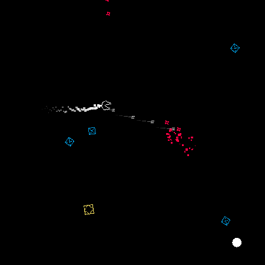

# Geometry-Battle

https://anmoose.itch.io/geometry-battle

A 2D space shooter game created in the Unity engine. Control a spaceship and destroy the attacking geometric shapes before they can get you! Use your blaster or fly into the bombs to create a massive explosion harming your enemies.

**Controls**
- W, A, S, D or Arrow Keys ...................... Move
- Mouse .......................................................... Aim
- Left Mouse Button .................................. Shoot

All assets and code were created custom. Key features from this game include:
- Custom object factory to optimize object creation in the scene.
- Three different kinds of enemies with their unique movement controllers. The yellow enemies will ignore the player and bounce off the screen boundary, the blue enemies will fly directly toward the player, and the red enemies are implemented using the boids flocking behaviour.
- Intelligent enemy spawning system, screen shake, particle effects, and player high score to improve the player experience.

